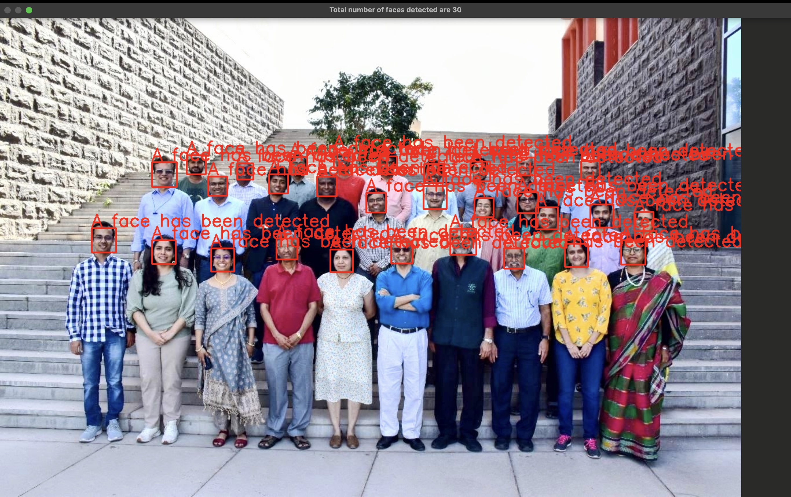
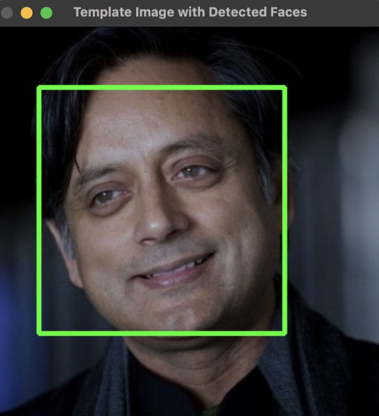

# Lab-5-Machine-Learning-and-Pattern-Recognition
## Aim:
### The aim of this lab is to explore distance-based machine learning techniques through a simple face analysis task. The experiment focuses on extracting meaningful features from images, clustering them using an unsupervised algorithm, and classifying a template image based on distance from learned clusters.
## Methodology:
### The lab was implemented in Python using a Jupyter Notebook. Images were read using OpenCV and converted to grayscale for face detection using Haar Cascade classifiers. Detected faces were transformed into the HSV color space, and mean Hue and Saturation values were extracted as features. KMeans clustering was then applied to group faces based on these features. A template image was processed similarly and assigned to the nearest cluster using distance-based prediction. The results were visualized using scatter plots showing face clusters, centroids, and the template image position.
## Key Findings:
### Faces with similar color characteristics were grouped into the same cluster,the template image was successfully classified into the closest cluster based on distance, HSV-based features provided better robustness to lighting variations compared to raw RGB values and visualizing clusters and centroids helped in interpreting the results clearly.
## Results:
### Face detection results with bounding boxes drawn on detected faces,scatter plot of faces in Hue–Saturation feature space,cluster centroids plotted alongside face samples and finally template image placement within the clustered feature space. 
### The images of the results are given below:-
### Face Detection in Group Image

### Feature-Based Clustering using KMeans(with images)

### Feature-Based Clustering using KMeans(with centroids)

### Face Detection in Template Image

### Feature-Based Clustering using KMeans(with images)

### Feature-Based Clustering using KMeans(with centroids)

